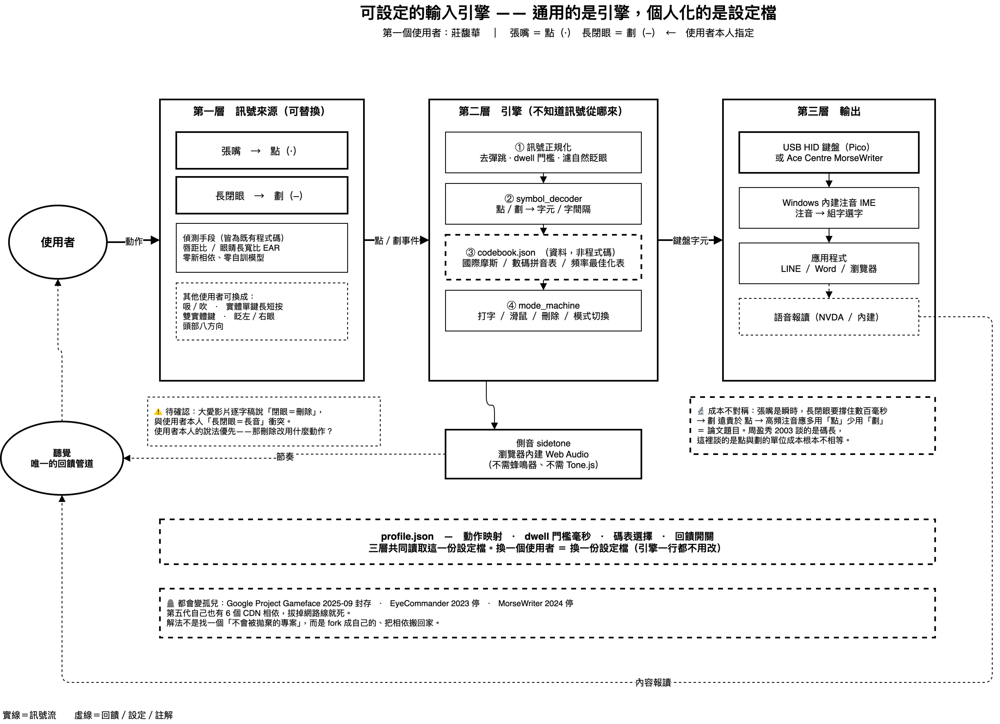

# Zhuyin Morse Input 注音摩斯輸入引擎

> 可設定的輸入引擎——**通用的是引擎，個人化的是設定檔。**

用臉部動作（或任何雙訊號來源）打摩斯碼、輸出注音符號的網頁工具。
為重度肢體障礙者設計，第一位使用者以「**張嘴＝點（·）、長閉眼＝劃（–）**」輸入。

🚧 **開發中（2026-07）**。目前為架構與碼表整備階段。

## 為什麼做這個

- 台灣的重障者輔具圈長期存在「注音摩斯碼」的實務，但**沒有官方標準，網路上也查無任何公開對照表**（GitHub 搜尋 `bopomofo morse` / `zhuyin morse` 為零結果，2026-07 查證）。本專案的 `codebook/` 會是第一份公開版本。
- 現行慣例（注音 → 大千鍵盤鍵位 → 國際摩斯碼）讓**高頻注音拿到最貴的碼**：例如 ㄢ 對應數字 0 ＝ `-----`，連續五個劃。周盈秀（2003）早已指出此設計「不符工時學、浪費重障者寶貴的擊鍵資源」，二十餘年無人接續。
- 身障輔具軟體的最大死因不是技術，是**無人維護**（Google Project Gameface 於 2025-09 封存即為一例）。本專案的對策：所有相依 vendor 進 repo、**離線可跑**、碼表與參數全部是資料檔。

## 三層架構

| 層 | 職責 | 可換性 |
|---|---|---|
| 訊號來源 | 臉部動作／實體開關／吸吹 → 點劃事件 | 依使用者身體狀況替換 |
| 引擎 | 去彈跳 → 解碼 → 查碼表 → 模式機 | 不知道訊號從哪來 |
| 輸出 | 頁面顯示（MVP）→ USB HID 鍵盤（後續） | — |

**`profile.json` 貫穿三層**：動作映射、dwell 門檻、碼表選擇、回饋開關。換一個使用者＝換一份設定檔。

## 碼表（codebook）

`codebook/zhuyin-morse-dachen-draft.json` 為**暫定推導版**（注音→大千鍵位→國際摩斯碼），僅供引擎開發測試。

⚠️ 它**不是**任何實際使用者正在使用的碼表，也不是標準。真實碼表取得後將以獨立檔案加入，屆時只需切換 profile，程式碼零修改。

## 設計原則

1. **可維護性 > 功能豐富** —— 零 CDN 相依、零自訓模型、拔網路線可跑
2. **碼表是資料，不是程式碼** —— 換編碼＝換一個 JSON 檔
3. **回饋走聽覺** —— 側音（Web Audio）＋逐符號報讀，為視障使用者設計

## 學術脈絡

- 周盈秀（2003）。《中文音頻與溝通輔具中摩斯碼之編碼》。輔仁大學語言學研究所碩士論文（指導教授：洪振耀）。—— 注音摩斯碼頻率最佳化的先行研究
- 本專案為國立臺南大學特殊教育學系博士論文《輔助科技在音樂之應用》之後續獨立研究

## License

MIT
